# CONNECT 4 GAME 

**Developer: Aleksandra Haniok**

💻 [Visit live website](https://ci-pp3-connect4.herokuapp.com/)

## About

This is a command-line version of the classic Connect Four game for two players.

The classic game is played on a standing board with seven columns of six rows where two players take turns dropping coloured discs from the top to the bottom into a column of their choice. The piece falls straight down, occupying the next available space within the column.

The objective of the game is to be the first one to achieve a horizontal, vertical or diagonal line of four connected discs.

## Table of Contents
  - [Project Goals](#project-goals)
    - [User Goals](#user-goals)
    - [Site Owner Goals](#site-owner-goals)
  - [User Experience](#user-experience)
    - [Target Audience](#target-audience)
    - [User Requirements and Expectations](#user-requirements-and-expectations)
    - [User Manual](#user-manual)
  - [User Stories](#user-stories)
    - [Users](#users)
    - [Site Owner](#site-owner)
  - [Technical Design](#technical-design)
    - [Flowchart](#flowchart)
  - [Technologies Used](#technologies-used)
    - [Languages](#languages)
    - [Frameworks & Tools](#frameworks--tools)
    - [Libraries](#libraries)
  - [Features](#features)
  - [Validation](#validation)
  - [Testing user stories](#testing-user-stories)
  - [Bugs](#bugs)
  - [Deployment](#deployment)
  - [Credits](#credits)
  - [Acknowledgements](#acknowledgements)

## Project Goals

### User Goals

- Play a fun and easy game with other player
- Read the rules of the game
- Be able to log in to an existing account

### Site Owner Goals

- Create a game that is easy and clear to user
- Ensure that users understand the purpose of the game
- Create a game that gives feedback to the user whilst playing

## User Experience

### Target Audience

There is no specific audience of this game. However, I would recommend that players are at least 6 years old, as per the classic board game.

### User Requirements and Expectations

- A simple, error-free game
- Straightforward navigation
- Game personalisation by entering players' names
- Feedback on game results

### User Manual

Click here to view instructions

#### Main Menu
On the main menu, users are presented with an ASCII art rendering of the name 'Connect 4'. Below the welcome graphic there are a couple of options for user to select from.
Operation: Input a numeric value and press enter key.
1. View game rules
2. Play game

At any point of the game, if the user inputs a number which do not correspond to the available option then they will be prompt to try again.

#### Game rules
With the first option to view game rules, the users are presented with a short game rules and once read they can go back to the main menu.
Operation: Click any key and enter.

#### Play
With the Play Game option, users are asked if they have played the game before or not.
Operation: Input a numeric value and press enter key. 
The extra available option is to press 'y' key for 'yes' and 'n' for 'No'.
1. Yes
2. No

#### Log-in
When selecting option 1, users are asked to input their email addresses they used in the previous game, starting with the Player 1.

The email goes through a validation process. If the user inputs an email that has not been registered they have an option to either try another email or create a new user.
Operation: Input a numeric value and press enter key.
1. Try another email
2. Create a new player

User can try to input their email address until it matches the one already registered. If it does, then the greeting message with their name will be displayed.
If they forgot their email address they can create a new players by selecting the second option.

Same option follow for Player2.

#### New players registration (sign-up)
This option is available from the play option menu and during the existing users log-in.
Here you can sign up to create a new user.

Firstly, the Player1 is asked for their name follow by the email address. Both values go through the validation.

Username has to be between 2-12 characters long and contain only A-Z. It can already exist in the database.
Email: has to be a valid email containing exactly one @-sign from an existing domain. It must not exist in the database.

Same option follow for Player2.

If the registration is selected as part of the log-in option (Create a new player), then the relevant player will need to input their name and email address and once validated, type the email again for log in.

#### Users greeting

Once both users have been logged in, the program will display a greeting message with both names and start the game.

#### Game

Players take turns to make their moves.
The player to start is randomly selected by the program.
The current player's name is displayed beneath the blue board showing which piece they play with. Player has to select which column they want to locate their piece in.
Operation: Input a numeric value between 1 - 7 and press enter key.

A selection of invalid column will display a warning message and ask user to select a valid column.

The game continues until one of the players connect their four pieces.

When a player wins, a message with their name is shown on the screen.

Players have 4 different options to choose from:
1. Play again
2. Go to main menu
3. See your statistics
4. Quit game

Operation: Input a numeric value and press enter key.

#### Play again
By selecting this option a new game starts for the same players.

#### Go to main menu
Brings players to the main menu of the program.

#### See your statistics
Display number of games won so far by each logged player.

#### Quit game
With the guit game option, the user exits the program with a goodbye message.

[Back to Table Of Contents](#table-of-contents)

## User Stories

### Users

1. I want to have clear options to select in the main menu
2. I want to be able to read the rules of the game
3. I want to personalise the game and enter my name
4. I want to be able to log-in if I return to the game
5. I want to receive a real time feedback throughout the game
6. I want to get a feedback when I win the game
7. I want to be able to play multiple games when I'm logged in
8. I want a random selection of the player to start a new game
9. I want to see how many games I've won so far

### Site Owner

10. I want users to have a positive experience whilst playing the game
11. I want users to easily select options from the menu
12. I want user names and emails to be saved to Google Spreadsheet
13. I want the user to get feedback in case of wrong input
14. I want data entry to be validated, to guide the user on how to correctly format the input

[Back to Table Of Contents](#table-of-contents)

## Technical Design

### Flowchart

The following flowchart summarises the structure and logic of the application.

Flowchart

## Technologies Used

### Languages

- [Python](https://www.python.org/) programming language for the logic of the program

### Frameworks & Tools

- [Diagrams.net](https://app.diagrams.net/) was used to draw program flowchart
- [Font Awesome](https://fontawesome.com/) - icons from Font Awesome were used in the footer below the program terminal
- [Git](https://git-scm.com/) was used for version control within VSCode to push the code to GitHub
- [GitHub](https://github.com/) was used as a remote repository to store project code
- [Google Cloud Platform](https://cloud.google.com/cloud-console/) was used to manage access and permissions to the Google Services such as Google auth, sheets etc.
- [Google Sheets](https://www.google.co.uk/sheets/about/) were used to store players details
- [Heroku Platform](https://dashboard.heroku.com/) was used to deploy the project into live environment
- [PEP8](http://pep8online.com/) was used to check my code against Python conventions
- [Visual Studio Code (VSCode)](https://code.visualstudio.com/)
VSCode was used to write the project code using Code Institute template

### Libraries

- [colorama](https://pypi.org/project/colorama/) - used to add color to the terminal and enhance user experience
- [email_validator](https://pypi.org/project/email-validator/) - used to validate user email input
- [gspread](https://docs.gspread.org/en/latest/) - used to add and manipulate data in my Google spreadsheet and to interact with Google APIs
- os - used to clear terminal
- random - used to alternate first player to start the game
- sys & sleep - used to create a typing effect within the games rules
- time - used to displayed delayed messages in the terminal

[Back to Table Of Contents](#table-of-contents)

## Features

### Main menu

- Provides user with graphic welcome message
- Gives user option to view game rules or start game
- User stories covered: 1, 2
 

    
Main Menu Screenshot

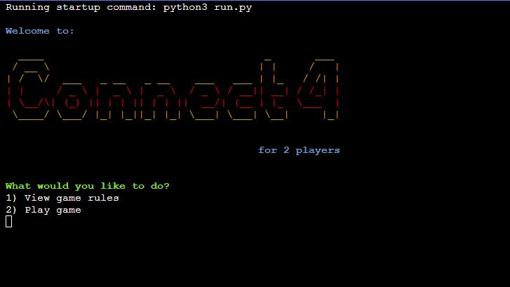

### Game rules
- Displays clear game rules
- Allows user to return to the main menu once read
- User stories covered: 2
  

    
Game rules Screenshot

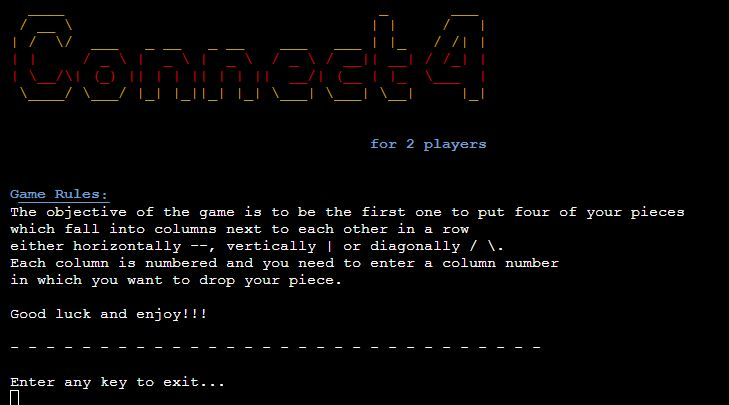

### Play options
- Gives players options to either log in or create a new user
- User stories covered: 4

    
Play options Screenshot

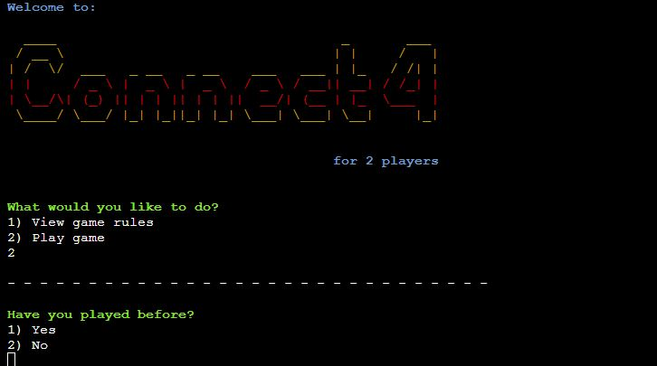

### Log-in
- Asks users for their email addresses
- Informs them if the email they input is incorrect or not registered
- Gives user alternative option to try another email or create a new player
- If correct, saves their details to Google Spreadsheet
- User stories covered: 4, 5, 12, 13, 14

    
Log-in Screenshot

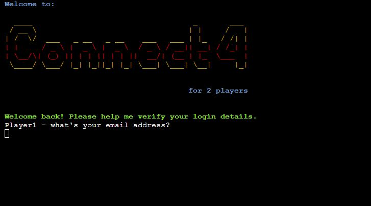

    
Alternative options Screenshot

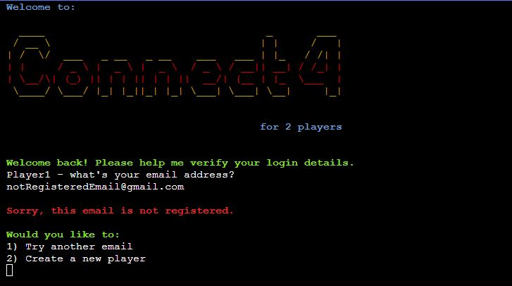

### Sign-up
- Asks user for their name and email address
- Validates user input values
- Informs user if the name they input is incorrect
- Informs user if the email is already taken and asks for another one
- User stories covered: 5, 12, 13, 14

    
Sign-up Screenshot

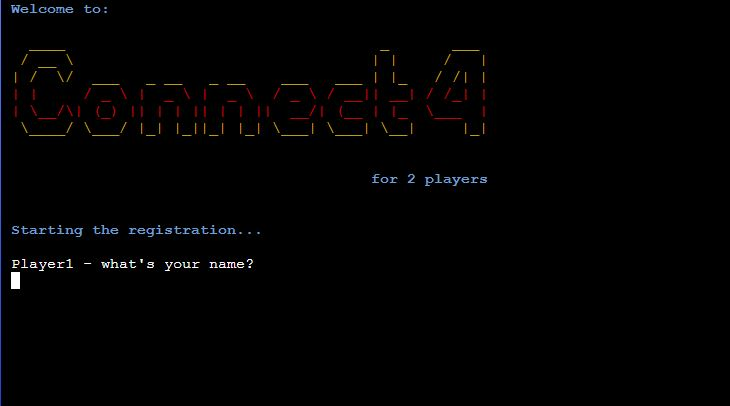

    
Sign-up email verification Screenshot

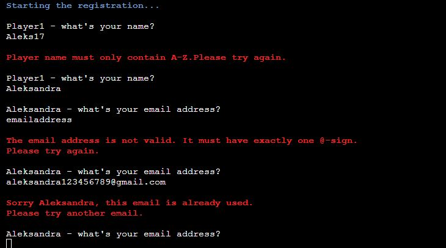

### Users greeting
- Displays a greeting message to the user once logged in
- User stories covered: 3, 10

    
Greeting Screenshot

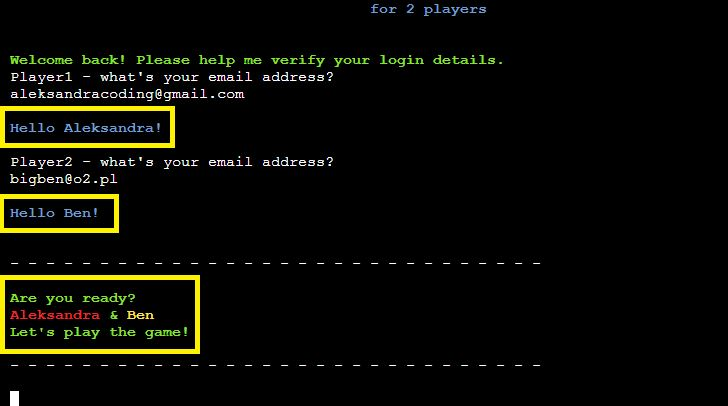

### Game
- Displays the name of currect player
- Players are asked to select the column to insert their piece
- Display warning message of incorrect column selected
- Provide feedback on who's won the game
- Gives options to play again after finished game
- User stories covered: 3, 5, 6, 13, 14

    
Game Screenshot

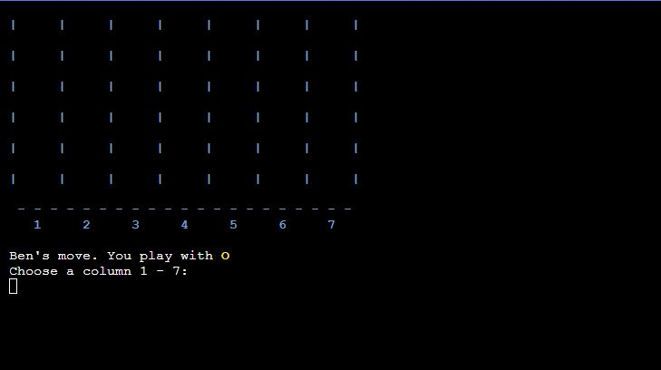

    
Incorrect Move in Game Screenshot

    
Winner Message Screenshot

### Finished Game options

    
Finished Game options Screenshot

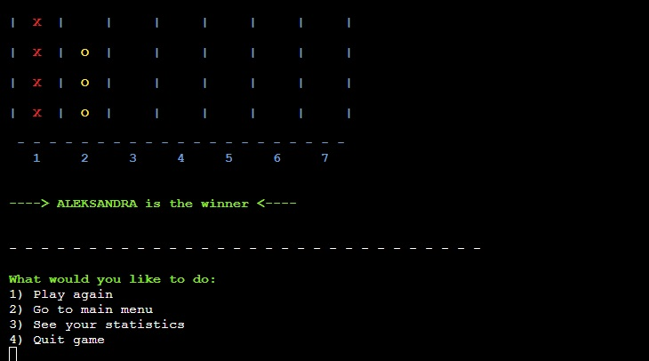

#### Play 
- Restarts the game for the same players
- User stories covered: 7

    
Restart game Screenshot

#### Go to main menu
- Brings players to the main menu of the program

#### See your statistics
- Display number of games won so far by each logged player
- User stories covered: 9

    
See your statistics Screenshot

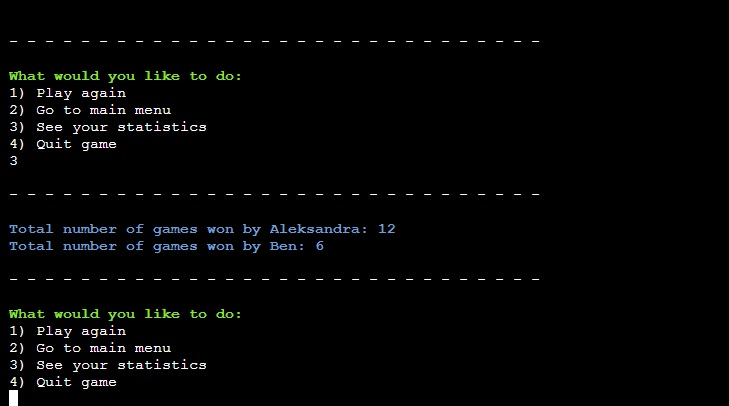

#### Quit game
- Exits the program with a goodbye message

    
Quit game Screenshot

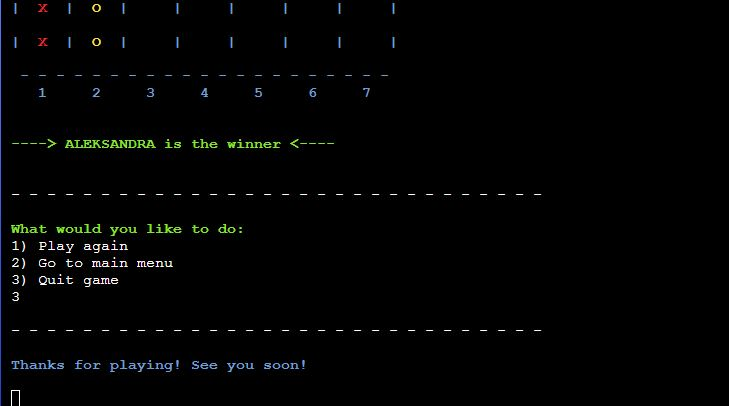

### User Input Validation
- Displays an error message if user input is not in a form that was expected
- Asks for a new input and provides guidance to user on how to correctly format the input
- User stories covered: 5, 13, 14

    
Username validation Screenshot

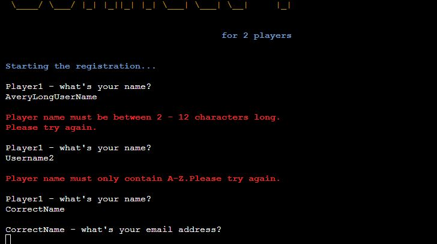

    
Email validation Screenshot

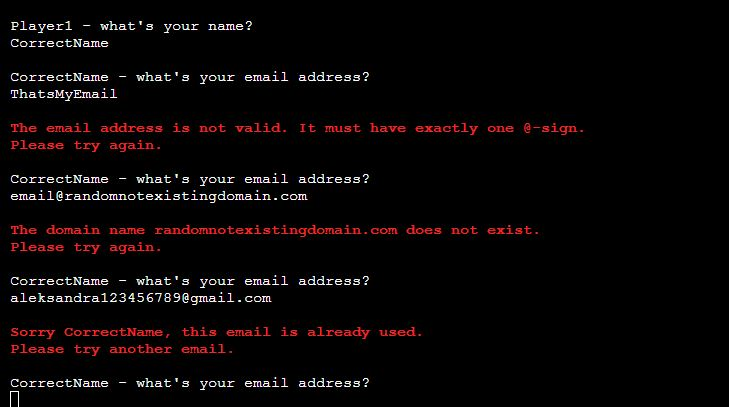

    
Validation of input during the game Screenshot

[Back to Table Of Contents](#table-of-contents)

## Validation

[PEP8 Validation Service](http://pep8online.com/) was used to check the code for PEP8 requirements. All the code passes with no errors and no warnings to show.

PEP3 check for run.py

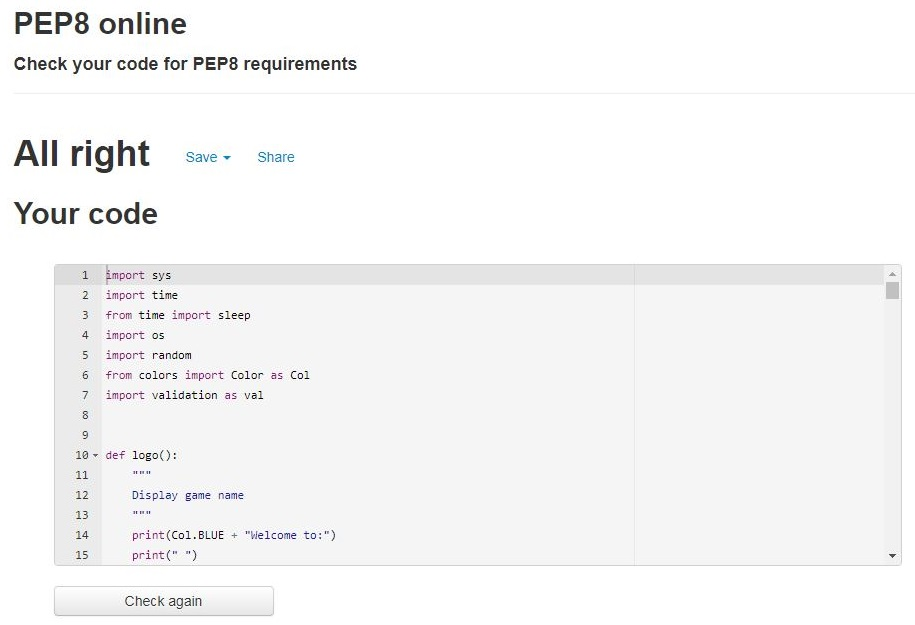

PEP3 check for validation.py

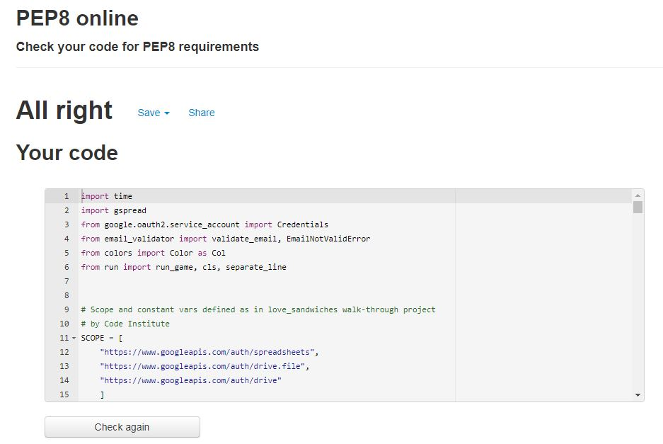

PEP3 check for colors.py

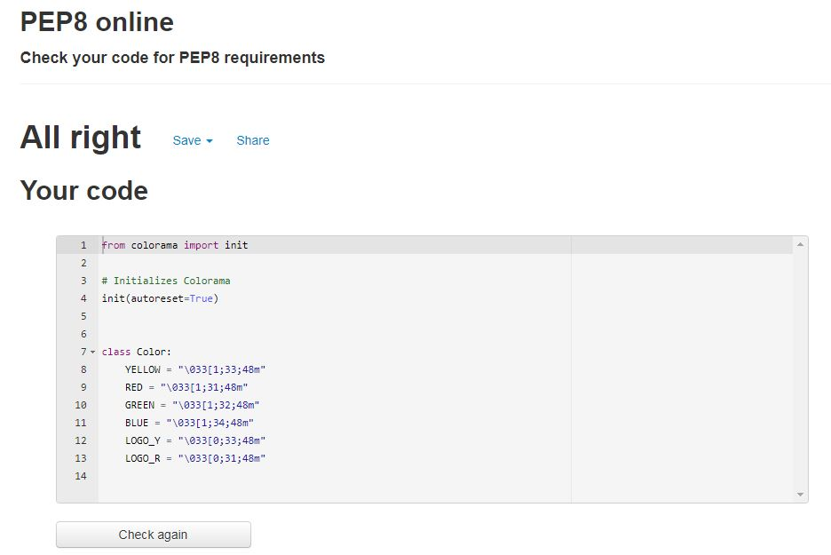

## Testing user stories

1. I want to have clear options to select in the main menu

| **Feature**   | **Action**                    | **Expected Result**          | **Actual Result** |
| ------------- | ----------------------------- | ---------------------------- | ----------------- |
| Main menu | Select option 1 | Users are presented with game rules | Works as expected |
| Main menu | Select option 2 | Users are asked if they played the game before | Works as expected |

Screenshot

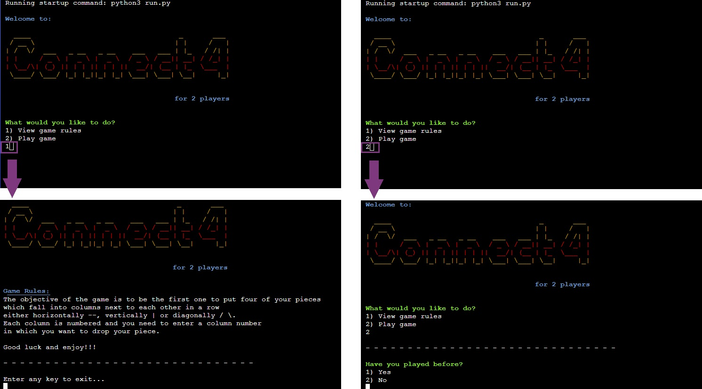

2. I want to be able to read the rules of the game

| **Feature**   | **Action**                    | **Expected Result**          | **Actual Result** |
| ------------- | ----------------------------- | ---------------------------- | ----------------- |
| Main menu | Select option 1 | Users are presented with game rules | Works as expected |

Screenshot

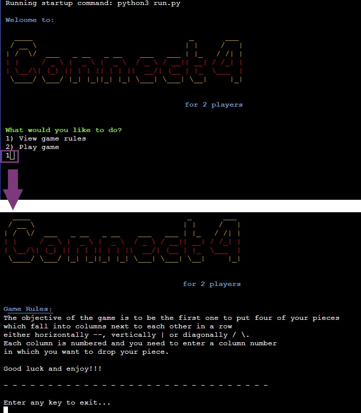

3. I want to personalise the game and enter my name

| **Feature**   | **Action**                    | **Expected Result**          | **Actual Result** |
| ------------- | ----------------------------- | ---------------------------- | ----------------- |
| Play game options | Select option 1 (log-in) | Users are asked to input their email addresses, and once validated, a greeting message with their name is displayed. Names are displayed during the game | Works as expected |
| Play game options | Select option 2 (sign-up) | Users are asked to input their names, once validated the names are saved and greeting message displayed. Names are displayed during the game | Works as expected |

Screenshot

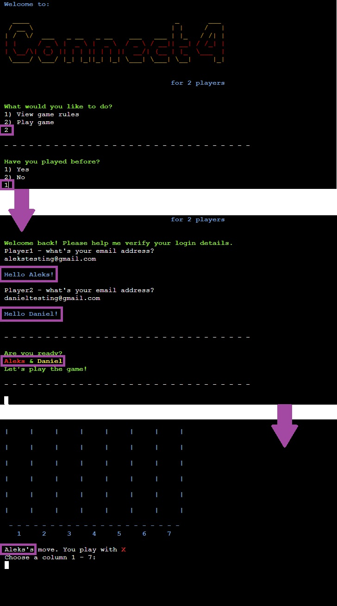

Screenshot

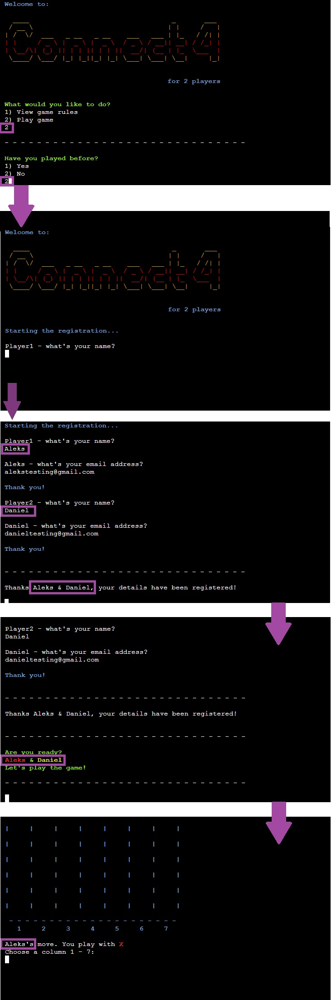

4. I want to be able to log-in if I return to the game

| **Feature**   | **Action**                    | **Expected Result**          | **Actual Result** |
| ------------- | ----------------------------- | ---------------------------- | ----------------- |
| Play game options | Select option 1 (log-in) | Returning users are asked to input the email address they registered before and once validated, a greeting message with their name is displayed | Works as expected |

Screenshot

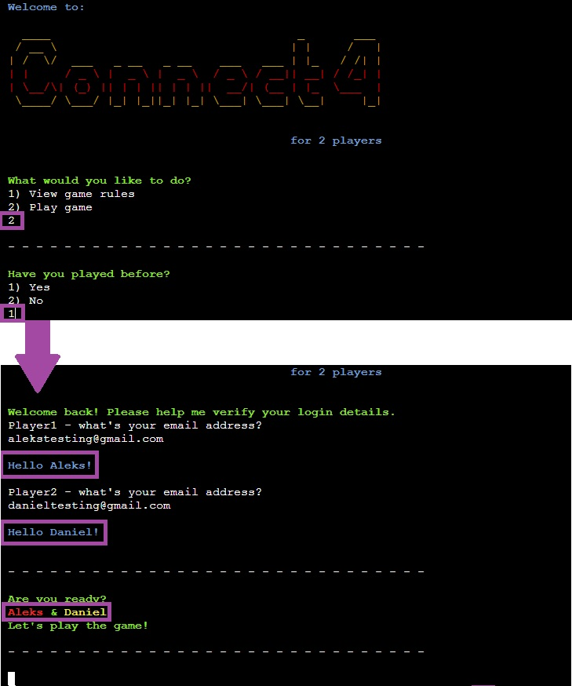

5. I want to receive a real time feedback throughout the game

| **Feature**   | **Action**                    | **Expected Result**          | **Actual Result** |
| ------------- | ----------------------------- | ---------------------------- | ----------------- |
| User Input Validation & Feedback through game play | Players will be informed if their input is invalid | Error messages displayed | Works as expected |

Screenshots

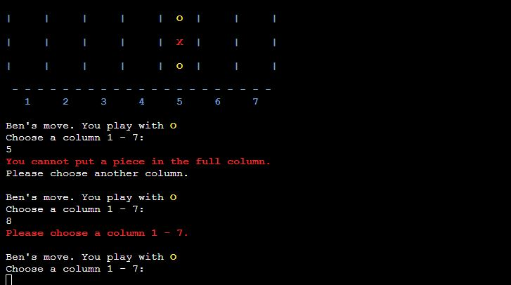

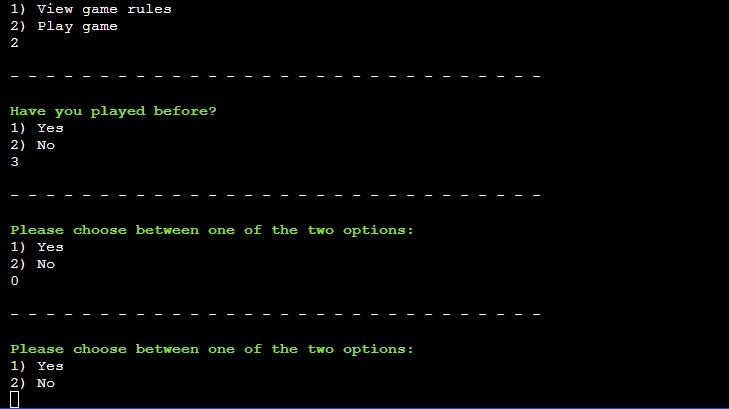

6. I want to get a feedback when I win the game

| **Feature**   | **Action**                    | **Expected Result**          | **Actual Result** |
| ------------- | ----------------------------- | ---------------------------- | ----------------- |
| Game screen | Player has connected 4 pieces in a row | Message is displayed with the winning player's name | Works as expected |

Screenshots

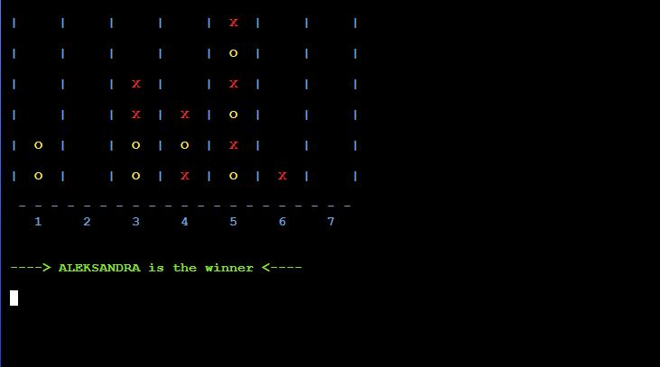
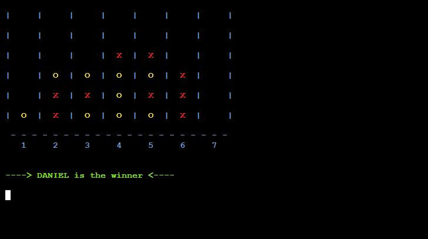

7. I want to be able to play multiple games when I'm logged in

| **Feature**   | **Action**                    | **Expected Result**          | **Actual Result** |
| ------------- | ----------------------------- | ---------------------------- | ----------------- |
| Finished Game options | User selects play again option  | The game restarts for the same players | Works as expected |

Screenshot

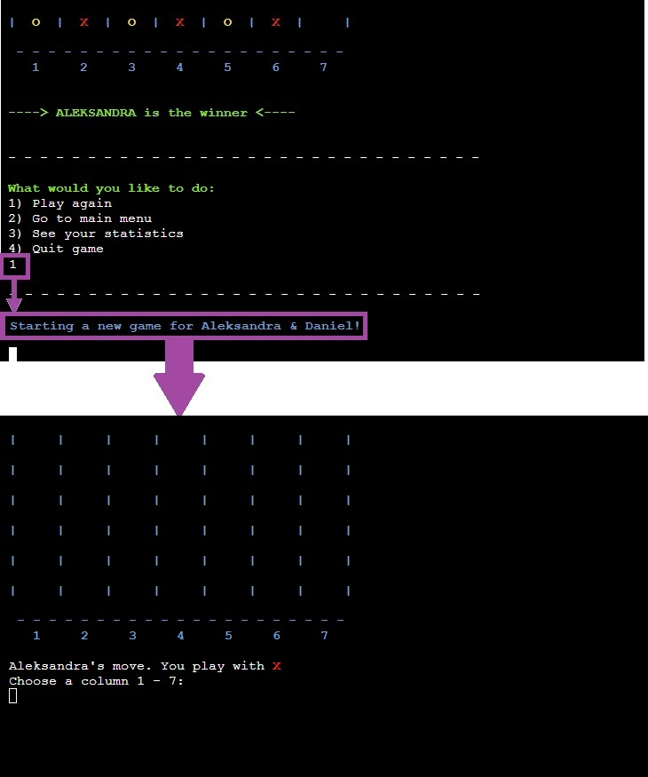

8. I want a random selection of the player to start a new game

| **Feature**   | **Action**                    | **Expected Result**          | **Actual Result** |
| ------------- | ----------------------------- | ---------------------------- | ----------------- |
| Game screen | Once players have logged-in or signed-up the game is loaded  | Different user names display | Works as expected |

Screenshots

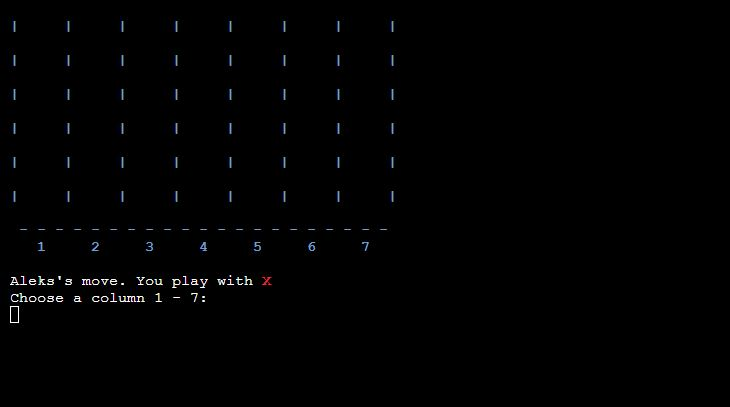
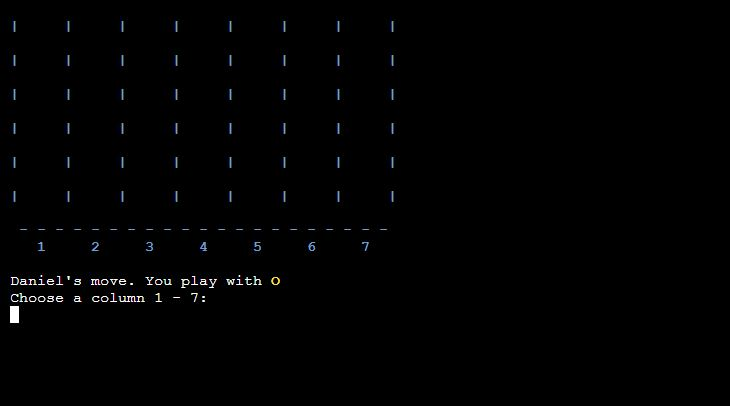

9. I want to see how many games I've won so far

| **Feature**   | **Action**                    | **Expected Result**          | **Actual Result** |
| ------------- | ----------------------------- | ---------------------------- | ----------------- |
| Finished Game options | Select option 3  | Display number of games won for Player1 & Player2 | Works as expected |

Screenshots

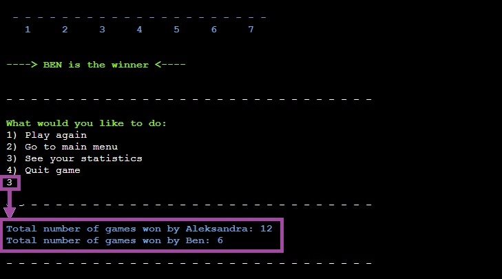

10. I want users to have a positive experience whilst playing the game

| **Feature**   | **Action**                    | **Expected Result**          | **Actual Result** |
| ------------- | ----------------------------- | ---------------------------- | ----------------- |
| Across all screen | Simple navigation and game play  | Colored messages and straightforward instructions | Works as expected |

Screenshots

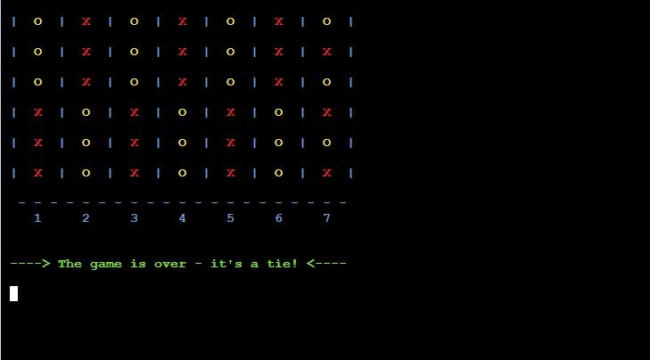
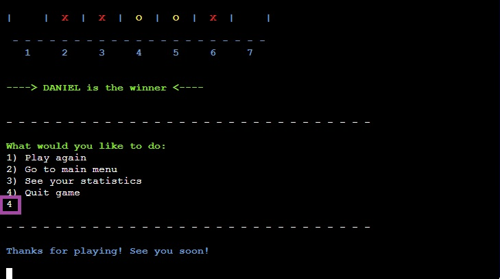
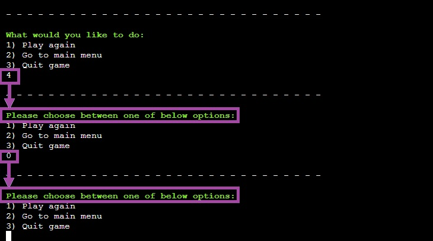

11.  I want users to easily select options from the menu

| **Feature**   | **Action**                    | **Expected Result**          | **Actual Result** |
| ------------- | ----------------------------- | ---------------------------- | ----------------- |
| Across all screen | User inputs invalid numeric value | Users are asked to try again between available options from the menu | Works as expected |

Screenshots

12.  I want user names and emails to be saved to Google Spreadsheet

| **Feature**   | **Action**                    | **Expected Result**          | **Actual Result** |
| ------------- | ----------------------------- | ---------------------------- | ----------------- |
| Log-in | Both users input their names and email address which has not been previously registered  | Username and email addresses are saved to Google Spreadsheet to the next available rows in columns 1 & 2 respectively | Works as expected |

Screenshot

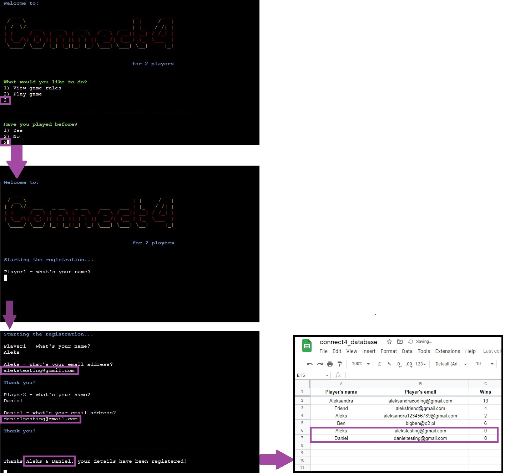

13.  I want the user to get feedback in case of wrong input

| **Feature**   | **Action**                    | **Expected Result**          | **Actual Result** |
| ------------- | ----------------------------- | ---------------------------- | ----------------- |
| Across all screen | User inputs invalid numeric value in the menu or game. User inputs invalid value during log-in or sign-up | Feedback message displayed to the user | Works as expected |

Screenshots

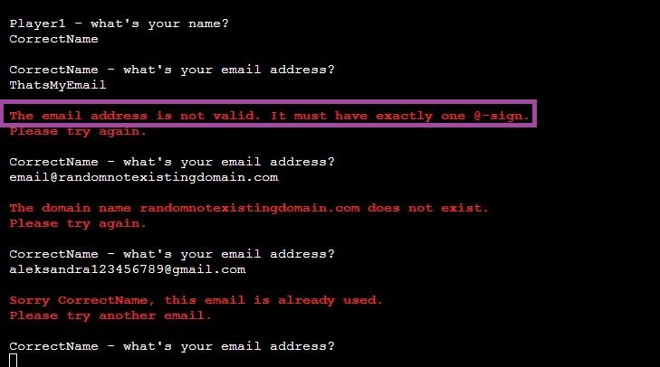
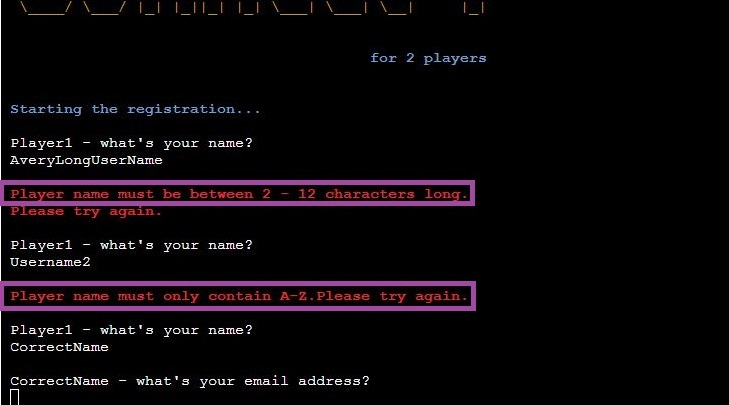

14.  I want data entry to be validated, to guide the user on how to correctly format the input

| **Feature**   | **Action**                    | **Expected Result**          | **Actual Result** |
| ------------- | ----------------------------- | ---------------------------- | ----------------- |
| Across all screen | User inputs invalid data | Feedback message with instructions diplayed to the user | Works as expected |

Screenshots

[Back to Table Of Contents](#table-of-contents)

## Bugs

| **Bug** | **Fix** |
| ------- | ------- |
| When selecting 'go back to main menu' option after the game has finished, the game title was not displayed | Correct the function's indentation |
| When selecting a correct menu option after a few wrong numeric inputs the relevant game option was not called | Move the while loop at the top within the function |
| Underscores within the game title were not displayed after deployment to Heroku portal | Changed color settings for yellow & red |
| Gradient background color does not take up the full screen size | Add background-attachment property |
| Players names input values are not displayed in the game – instead of name a “‘Player1’’s / ‘Player2’’s move.” is shown | Reassign a value of player1name & player2name to the indexed-0 value (name) input by the user in ‘create_new_players’ function |
| Users input data was recorded in the same row in four columns instead of 2 separate rows | Created a list of players and while loop inside the 'register_new_players' function for Google Spreadsheet update separately for two players |
| There were quite a few errors and warnings related to exceeded number of characters in line, whitespace within a blank line, trailing white spaces or missing white spaces around operators | Split the comments or print functions into two separate rows maintaining correct indentation. Followed a guidance within pep8 online tool and corrected all warnings and errors |

## Deployment

### Heroku
This application has been deployed from GitHub to Heroku by following the steps:

1. Create or log in to your account at heroku.com
2. Create a new app, add a unique app name (this project is named "ci-pp3-connect4") and choose your region
3. Click on create app
4. Go to "Settings"
5. Under Config Vars store any sensitive data you saved in .json file. Name 'Key' field, copy the .json file and paste it to 'Value' field. Also add a key 'PORT' and value '8000'.
6. Add required buildpacks (further dependencies). For this project, I set up 'Python' and 'node.js' in that order.
7. Go to "Deploy" and select "GitHub" in "Deployment method"
8. To link up our Heroku app to our Github repository code enter your repository name, click 'Search' and then 'Connect' when it shows below
9.  Choose the branch you want to buid your app from
10. If prefered, click on "Enable Automatic Deploys", which keeps the app up to date with your GitHub repository
11. Wait for the app to build. Once ready you will see the “App was successfully deployed” message and a 'View' button to take you to your deployed link.

### Forking the GitHub Repository
1. Go to the GitHub repository
2. Click on Fork button in top right corner
3. You will then have a copy of the repository in your own GitHub account.
   
### Making a Local Clone
1. Go to the GitHub repository 
2. Locate the Code button above the list of files and click it
3. Highlight the "HTTPS" button to clone with HTTPS and copy the link
4. Open Git Bash
5. Change the current working directory to the one where you want the cloned directory
6. Type git clone and paste the URL from the clipboard ($ git clone https://github.com/YOUR-USERNAME/YOUR-REPOSITORY)
7. Press Enter to create your local clone

[Back to Table Of Contents](#table-of-contents)

## Credits

### Images
- [Flaticon](https://www.flaticon.com/free-icon/connect_1707222) was used for the website favicon

### Code
- [ASCII Art Generator](http://patorjk.com/software/taag/) was used to create game title
- Code Institute - for git template IDE and "Love Sandwiches - Essentials Project" which helped me with connecting the Google Spreadsheet to my project.
- [ColorSpace](https://mycolor.space/gradient) was used to create a gradient button and background effect
- How to install a Python module, eg. [email validation](https://pypi.org/project/email-validator/Installing)
- [gspread documentation](https://docs.gspread.org/en/latest/user-guide.html) explained how to obtain a specific value from the google spreadsheet
- Instructions how to print colored text from [this](https://ozzmaker.com/add-colour-to-text-in-python/) and [this](https://stackabuse.com/how-to-print-colored-text-in-python/) sources
- [Stack overflow](https://stackoverflow.com/questions/20302331/typing-effect-in-python) helped me create typing effect in games rules
- [Stack overflow](https://stackoverflow.com/questions/517970/how-to-clear-the-interpreter-console) code used to clear the terminal console
- Youtube tutorial [“Python Connect 4 Tutorial”](https://www.youtube.com/watch?v=gvP0gNSO17k&t=429s) made by [Spencer Lepine](https://www.youtube.com/channel/UCBL6vAHJZqUlyJp-rcFU55Q) - I used a part of Spencer's code for display of the game board, moves of alternative players and saving last move's coordinates on the board
- Youtube tutorial [“Creating a Connect 4 Game in Python”](https://www.youtube.com/watch?v=Bk2ny_aeG-Y) made by [“Painless Programming”](https://www.youtube.com/channel/UC8ck1Yks7yP33XInXw5GZIw) -  inspired me to create a schemat for winning move logic

See winning move schemat

## Acknowledgements
I would like to thank everyone who supported me in the development of this project:
- My mentor Mo for professional guidance, helpful feedback and words of encouragement whilst creating the project
- My partner for his support and playing/testing the game with me
- Code Institute community on Slack for resources and support
