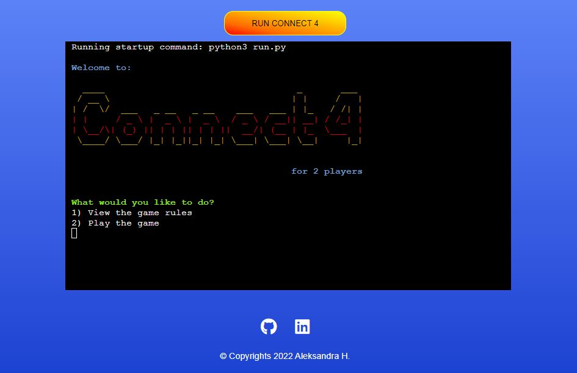

# CONNECT 4 GAME 

**Developer: Aleksandra Haniok**

💻 [Visit live website](https://ci-pp3-connect4.herokuapp.com/)

## About

This is a command-line version of the classic Connect Four game for two players.

The classic game is played on a standing board with seven columns of six rows where two players take turns dropping coloured discs from the top to the bottom into a column of their choice. The piece falls straight down, occupying the next available space within the column.

The objective of the game is to be the first one to achieve a horizontal, vertical or diagonal line of four connected discs.

## Table of Content

## Project Goals

### User Goals

• Play a fun and easy game with other player
• Read the rules of the game
• Be able to log in to an existing account

### Site Owner Goals

• Create a game that is easy and clear to user
• Ensure that users understand the purpose of the game
• Create a game that gives feedback to the user whilst playing

## User Experience

### Target Audience

There is no specific audience of this game. However, I would recommend that players are at least 6 years old, as per the classic board game.

### User Requirements and Expectations

• A simple, error-free game
• Straightforward navigation
• Game personalisation by entering players' names
• Feedback on game results

### User Manual

Click here to view instructions to use

#### Main Menu
On the main menu, users are presented with an ASCII art rendering of the name 'Connect 4'. Below the welcome graphic there are a couple of options for user to select from.
Operation: Input a numeric value and press enter key.
1. View game rules
2. Play game

At any point of the game, if the user inputs a number which do not correspond to the available option then they will be prompt to try again.

#### Game rules
With the first option to view game rules, the users are presented with a short game rules and once read they can go back to the main menu.
Operation: Click any key and enter.

#### Play
With the Play Game option, users are asked if they have played the game before or not.
Operation: Input a numeric value and press enter key. 
The extra available option is to press 'y' key for 'yes' and 'n' for 'No'.
1. Yes
2. No

#### Users' validation
When selecting option 1 (log-in), users are asked to input their email addresses they used in the previous game, starting with the Player 1.

The email goes through a validation process. If the user inputs an email that has not been registered they have an option to either try another email or create a new user.
Operation: Input a numeric value and press enter key.
1. Try another email
2. Create a new player

User can try to input their email address until it matches the one already registered. If it does, then the greeting message with their name will be displayed.
If they forgot their email address they can create a new players by selecting the second option.

Same option follow for Player2.

#### New players registration
This option is available from the play option menu and during the existing users log-in.
Here you can sign up to create a new user.

Firstly, the Player1 is asked for their name follow by the email address. Both values go through the validation.

Username has to be between 2-12 characters long and contain only A-Z. It can already exist in the database.
Email: has to be a valid email containing exactly one @-sign from an existing domain. It must not exist in the database.

Same option follow for Player2.

If the registration is selected as part of the log-in option (Create a new player), then the relevant player will need to input their name and email address and once validated, type the email again for log in.

#### Users greeting

Once both users have been logged in, the program will display a greeting message with both names and start the game.

#### Game

Players take turns to make their moves.
The player to start is randomly selected by the program.
The current player's name is displayed beneath the blue board showing which piece they play with. Player has to select which column they want to locate their piece in.
Operation: Input a numeric value between 1 - 7 and press enter key.

A selection of invalid column will display a warning message and ask user to select a valid column.

The game continues until one of the players connect their four pieces.

When a player wins, a message with their name is shown on the screen.

Players have 3 different options to choose from:
1. Play again
2. Go to main menu
3. Quit game
Operation: Input a numeric value and press enter key.

#### Play again
By selecting this option a new game starts for the same players

#### Go to main menu
Brings players to the main menu of the program

#### Quit game
With the guit game option, the user exits the program with a goodbye message.

## User Stories

### First time Users

### Returning Users

### Site Owner

## Technical Design

### Flowchart

## Technologies Used

### Languages

### Frameworks, Libraries & Tools

## Features

## Validation

## Testing user stories

### First time user

### Returning Users

### Site Owner

## Bugs

## Deployment

### GitHub Pages

#### Forking the GitHub Repository

#### Making a Local Clone

### Heroku Platform

## Considerations

## Credits

### Images

### Code

## Future Features

## Acknowledgements
